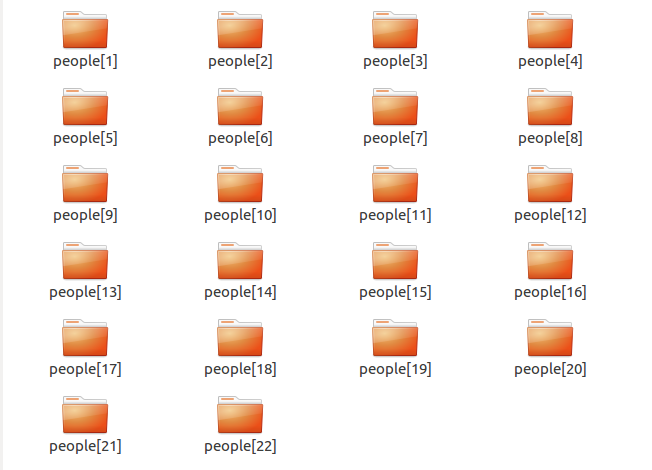
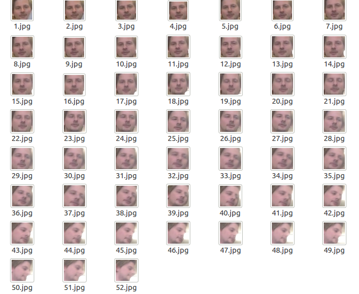
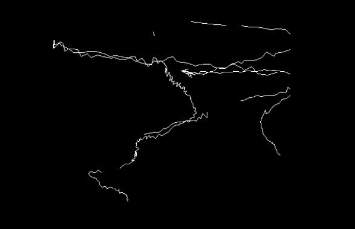

**face_detect system**
 
 **思路**
 
  在大部分的嵌入式设备(性能一般)实现一套人脸检测系统，对视频进行人脸关键信息筛选上传至云端做后续处理。
   因此，设计过程为：
   
   - 1.输入视频---人脸检测--人脸追踪分类--属于一类的人脸最多上传5张。
   - 2.长时间未出现人脸，从人脸检测切换至唤醒算法。
                                          
 **效果**
 
 
 
 
**简述**

  - 采用seetaface人脸检测器
  -  实现一个人脸检测窗口大小的自适应算法，只检测距离摄像头m米内的人脸。提过两种方法 1.人工输入参数  2.相机标定
  - 设计实现了休眠唤醒算法，长时间未检测出人脸进入休眠模式。在休眠模式下,有人闯入可以较好的唤醒人脸检测算法。主要方法为：移动侦测-移动区域肤色分析-区域判断。（大津法求阈值）
  -  设计实现了人脸跟踪算法。
  - 将抓取的人脸保存到本地文件夹(可设置路径)，超时文件删除。采用boost filesystem支持跨平台的文件系统。
  
  **Require**
   opencv 3.0 
   c++  boost 
    
    
   **build**
   mkdir build
   cd build 
   cmake .. 
    make
    
    
 **测试**
 
   - pc测试 
   图像:1280x720
   环境：i7 4770k 3.8Ghz
    速度:设置最小人脸窗口40x40,滑动步长(4,4) ,8~12fps。
    
   - 嵌入式设备测试
  图像:1280x720
环境：某芯片 1.2Ghz+8Mhz
速度:设置最小人脸窗口40x40,滑动步长(4,4),使用某芯片自带的浮点加速，大约1fps 。

